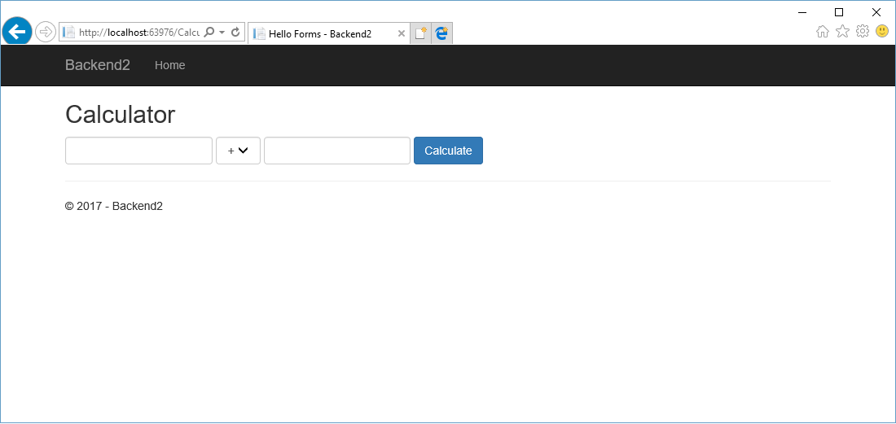
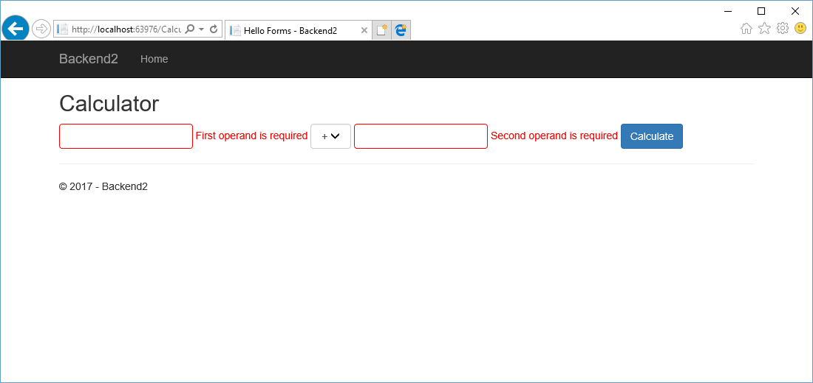
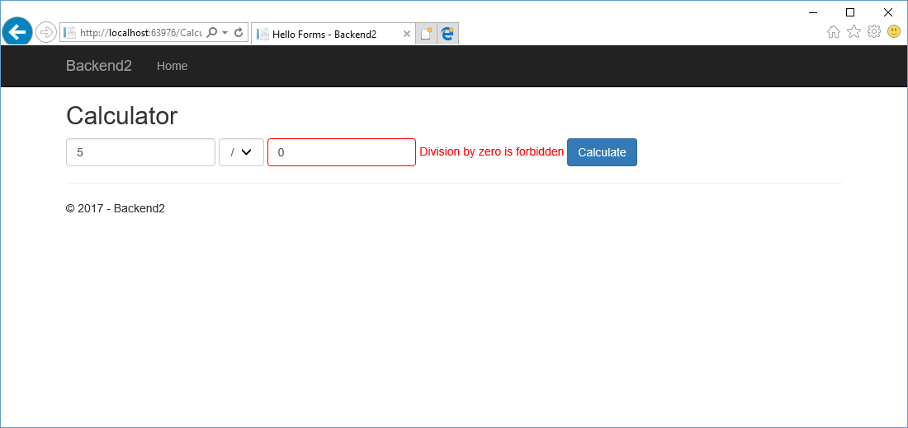

# Практика №2

## Темы

1. Получение данных с форм
2. Model Binding
3. Validation & ModelState

## Задачи

1. Ознакомиться с заготовленным проектом.
2. В заготовленном проекте:
   1. Определить, реализовать и зарегистрировать службу:
      * Служба, позволяющая выполнять основные арифметические операции над целыми числами (+, -, *, /).
   2. Реализовать контроллер, который будет использовать эту службу для того, чтобы
      * Предоставить пользователю форму для ввода чисел и выбора оператора.
      * Получить данные, введенные пользователем (всеми разобранными способами).
      * Проверить корректность введенных данных (операнды указаны, нет деления на 0).
      * С использованием реализованной службы вычеслить результат арифметической операции и вывести его на страницу
   3. Реализовать набор представлений для этого контроллера.
   4. Из представления Home/Index сделать ссылки на дейсвия нового контроллера.

## Результат








## Материалы

### HTML form

HTML-форма (тег `<form>`) - элемент HTML-страницы, предназначенный для отправки данных со страницы на сервер.
Форма может содержать поля - элементы, предназначенные для заполнения пользователем.

Виды полей:
* `<input>`
  * `<input type="hidden" />`
  * `<input type="text" />`
  * `<input type="radio" />`
  * `<input type="checkbox" />`
  * `<input type="password" />`
* `<select>` 
* `<textarea>`
* `<button>`
  * `<button type="submit">`

### Способы получения данных с форм

#### Прямой доступ к переданным полям формы

Прямой доступ к полям формы можно получить через свойство `Form` класса `HttpRequest`, к экземпляру которого можно получить 
доступ через свойство `Request` контроллера, либо через выражение `Context.Request` представления.

Пример:
```csharp
String name = this.Request.Form["Name"];
```

Отправка данных формы на сервер, как правило, выполняется с помощью HTTP-метода `POST`.
Определить, какой HTTP-метод был использован при совершении запроса, можно через свойство `Method` класса `HttpRequest`.

#### Использование различных методов контроллера для обработки разных HTTP-методов в одном Action-е.

Вместо того, чтобы анализировать значение свойства `Method`, можно сделать два различных метода для одного Action-а.
Для того, чтобы ASP.NET мог их различить, необходимо как минимум один из них пометить атрибутом `[HttpGet]` или `[HttpPost]`. 
(Если их более 2 - то атрибут должен быть определен для всех методов, кроме одного). 
В случае если эти методы будут иметь одинаковый набор параметров, необходимо назвать их по разному, и с помощью атрибута `[ActionName]` указать что они относятся к одному Action-у.

Пример:
```csharp
public ActionResult ManualWithSeparateHandlers()
{
    // GET method processing
    return this.View();
}

[HttpPost, ActionName("ManualWithSeparateHandlers")]
public ActionResult ManualWithSeparateHandlersConfirm()
{
    // POST method processing
    return this.View();
}
```

#### Использование Model Binding

Вместо того, чтобы получать прямой доступ к полям через свойство `Form`, можно использовать механизм ModelBinding.
Данный механизм позволяет определить в методах контроллера набор параметров, значения которых будут устанвлены при вызове метода.
Привязка полей осуществляется по имени параметра или по имени свойства класса.

```csharp
[HttpPost]
public ActionResult ModelBindingInParameters(String name)
{
    // name will be set from "Name" form field
    return this.View();
}
```

```csharp
public class GreetingViewModel
{
    public String Name { get; set; }
}

[HttpPost]
public ActionResult ModelBindingInSeparateModel(GreetingViewModel model)
{
    // model.Name will be set from "Name" form field
    return this.View(model);
}
```

### Валидация полей форм

Валидация полей форм - механизм, проверяющий правильность значений полей.

Способы валидации:
1. Проверять значения в контроллере вручную.
2. Использовать специальные валидационные атрибуты, например `[Required]` - требует наличие значения.

Валидация с помощью атрибутов добавляет ошибки в `ModelStateDictionary` и может их привязывать к конкретным полям. Эти ошибки затем можно вывести в представлении с помощью специльных тег-хелперов:
```
<span asp-validation-for="Name"></span>
```
для ошибок конкретного поля и
```
<div asp-validation-summary="ModelOnly"></div>
```
для ошибок не привязанных к конкретному полю.

Проверить наличие ошибок можно с помощью свойства `IsValid` класса `ModelStateDictionary`:
```csharp
if (this.ModelState.IsValid)
{
    // Everything is OK
}

// Model has errors - display same page again
return this.View(model);
```

Пример валидации с помощью атрибутов:
```csharp
public class GreetingViewModel
{
    [Required(ErrorMessage = "Name is required")]
    public String Name { get; set; }
}
```

Пример ручной валидации:
```csharp
if (model.Name.ToLowerInvariant().Contains("admin"))
{
    this.ModelState.AddModelError("Name", "You are not admin");
    return this.View(model);
}
```